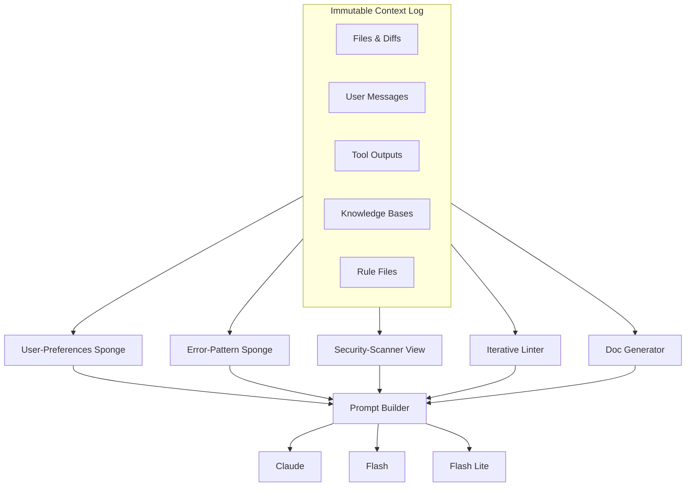

# Immutable Context Architecture

## Architecture Components

### Immutable Context Log
- **Files & Diffs** - Code changes and file states
- **User Messages** - All user communications across projects
- **Tool Outputs** - Results from tool executions
- **Knowledge Bases** - External knowledge sources
- **Rule Files** - Configuration and rules

### Context Sponges
- **User-Preferences Sponge** - Extracts rants, reverts, repeated actions
- **Error-Pattern Sponge** - Identifies and prevents repetitive errors
- **Security-Scanner View** - Remembers past security findings & fixes
- **Iterative Linter** - Tracks lint fixes and only shows new errors
- **Doc Generator** - Tracks which files have been documented

### Model Routing
- **Prompt Builder** - Combines sponge outputs into model-specific prompts
- **Claude** - Full-featured model with XML policy tags
- **Flash** - Fast model for quick responses
- **Flash Lite** - Ultra-trimmed model for code-edit focus

