# diagram-dsl

A high-level TypeScript DSL for creating diagrams and flowchart-heavy slides using React and JSX. Generate beautiful SVG diagrams without dragging boxes around or fighting with layout engines.

## Philosophy

Most graphical diagram tools require manual positioning and constant tweaking. Text-based tools like Mermaid, D2, or Graphviz try to auto-layout everything, which often requires hacks when you want specific layouts. This library takes a different approach:

- **Declarative JSX syntax** - Describe your diagrams like you describe UIs
- **Flexible layout primitives** - Stack, Row, Column components with padding, gaps, and alignment
- **Yoga layout engine** - Battle-tested flexbox layout (same engine used by React Native)
- **SVG output** - No browser needed, pure SVG generation
- **TypeScript first** - Full type safety and IntelliSense support

## Features

✨ **High-level DSL** - Describe diagrams using familiar React JSX syntax  
🎨 **Flexible Layout** - Stack, Row, Column with gaps, padding, and alignment  
🎭 **Semantic Components** - Card, Title, Subtitle, Label with professional styling  
🌈 **Theme System** - Built-in color palette, typography scale, and spacing  
⚡ **Yoga Layout Engine** - Battle-tested flexbox implementation from React Native  
📦 **No Browser Required** - Pure SVG generation, no headless browser needed  
🔒 **TypeScript First** - Full type safety and excellent IntelliSense support  
🎯 **Simple & Powerful** - Easy for simple diagrams, powerful for complex ones

## Installation

```bash
npm install diagram-dsl
```

## Quick Start

```tsx
import React from 'react';
import { Stack, Box, Text, Arrow, renderToSVG } from 'diagram-dsl';
import { writeFileSync } from 'fs';

const MyDiagram = () => (
  <Stack gap={20} padding={40} alignItems="center">
    <Text fontSize={32} fontWeight="bold">My Flowchart</Text>
    
    <Box
      id="step1"
      width={200}
      height={80}
      backgroundColor="#e3f2fd"
      borderColor="#1976d2"
      borderWidth={2}
      borderRadius={8}
      padding={20}
      justifyContent="center"
      alignItems="center"
    >
      <Text fontSize={18}>First Step</Text>
    </Box>

    <Box
      id="step2"
      width={200}
      height={80}
      backgroundColor="#f3e5f5"
      borderColor="#7b1fa2"
      borderWidth={2}
      borderRadius={8}
      padding={20}
      justifyContent="center"
      alignItems="center"
    >
      <Text fontSize={18}>Second Step</Text>
    </Box>

    <Arrow from="step1" to="step2" color="#1976d2" strokeWidth={2} />
  </Stack>
);

async function generate() {
  const svg = await renderToSVG(<MyDiagram />, { 
    width: 800, 
    height: 600,
    backgroundColor: 'white'
  });
  writeFileSync('diagram.svg', svg);
}

generate();
```

## Quick Start with Semantic Components

For even cleaner diagrams with professional styling:

```tsx
import React from 'react';
import { Stack, Card, Title, Subtitle, Label, Arrow, renderToSVG } from 'diagram-dsl';
import { writeFileSync } from 'fs';

const MyDiagram = () => (
  <Stack gap={24} padding={40} alignItems="center">
    <Title level={1}>My Flowchart</Title>
    <Subtitle>Clean and professional</Subtitle>
    
    <Card id="step1" variant="primary" width={200} height={80}>
      <Stack gap={6} alignItems="center">
        <Label bold>First Step</Label>
        <Subtitle>Initialize</Subtitle>
      </Stack>
    </Card>

    <Card id="step2" variant="success" width={200} height={80}>
      <Stack gap={6} alignItems="center">
        <Label bold>Second Step</Label>
        <Subtitle>Process</Subtitle>
      </Stack>
    </Card>

    <Arrow from="step1" to="step2" color="#1976d2" strokeWidth={2} />
  </Stack>
);

async function generate() {
  const svg = await renderToSVG(<MyDiagram />, { 
    width: 800, 
    height: 600,
    backgroundColor: 'white'
  });
  writeFileSync('diagram.svg', svg);
}

generate();
```

**Benefits of semantic components:**
- 🎯 Less code - no need to specify colors, fonts, sizes manually
- 🎨 Consistent styling - uses a professional theme system
- 📝 Rich text - easily combine titles, labels, and subtitles
- 🔄 Easy updates - change `variant` to update colors

See [STYLING_GUIDE.md](STYLING_GUIDE.md) for complete documentation.

## Components

### Semantic Components (Recommended)

#### Card

A styled box with professional defaults and color variants.

```tsx
<Card variant="primary" width={200} height={100}>
  <Label>Content</Label>
</Card>
```

**Variants:** `primary`, `secondary`, `success`, `warning`, `error`, `info`, `default`

#### Title

Large, bold text for diagram titles and section headings.

```tsx
<Title level={1}>Main Title</Title>      {/* 36px */}
<Title level={2}>Section Title</Title>  {/* 24px */}
<Title level={3}>Subsection</Title>     {/* 20px */}
```

#### Subtitle

Smaller, gray text for secondary information.

```tsx
<Subtitle>Supporting text</Subtitle>           {/* 12px */}
<Subtitle size="base">Larger subtitle</Subtitle> {/* 14px */}
```

#### Label

Regular text with flexible sizing.

```tsx
<Label>Normal text</Label>         {/* 14px */}
<Label size="sm">Small text</Label>  {/* 12px */}
<Label size="lg">Large text</Label>  {/* 16px */}
<Label bold>Bold text</Label>
```

### Low-Level Components

#### Box

The basic building block. Can contain other components and has full layout control.

```tsx
<Box
  width={200}
  height={100}
  backgroundColor="#f0f0f0"
  borderColor="black"
  borderWidth={2}
  borderRadius={8}
  padding={20}
  margin={10}
  alignItems="center"
  justifyContent="center"
  position="relative"
  id="mybox"
>
  {/* children */}
</Box>
```

### Stack

Arranges children vertically (default) or horizontally with automatic spacing.

```tsx
<Stack
  direction="vertical" // or "horizontal"
  gap={20}
  alignItems="center"
  justifyContent="space-between"
  padding={40}
>
  {/* children */}
</Stack>
```

### Row

Arranges children horizontally. Shorthand for `<Stack direction="horizontal">`.

```tsx
<Row gap={10} alignItems="center">
  <Box width={100} height={100} backgroundColor="red" />
  <Box width={100} height={100} backgroundColor="blue" />
  <Box width={100} height={100} backgroundColor="green" />
</Row>
```

### Column

Arranges children vertically. Shorthand for `<Stack direction="vertical">`.

```tsx
<Column gap={10} alignItems="center">
  <Box width={200} height={50} backgroundColor="red" />
  <Box width={200} height={50} backgroundColor="blue" />
</Column>
```

### Text

Renders text with full typography control.

```tsx
<Text
  fontSize={24}
  fontWeight="bold"
  color="#333"
  fontFamily="Arial, sans-serif"
  textAlign="center"
>
  Hello World
</Text>
```

### Arrow

Draws an arrow between two boxes (identified by their `id` props).

```tsx
<Arrow
  from="box1"
  to="box2"
  color="#1976d2"
  strokeWidth={2}
  label="connects to"
/>
```

## Layout Props

All components support these layout properties:

- `width`, `height` - Fixed dimensions or `"auto"`
- `minWidth`, `minHeight`, `maxWidth`, `maxHeight` - Size constraints
- `padding`, `paddingTop`, `paddingBottom`, `paddingLeft`, `paddingRight`
- `margin`, `marginTop`, `marginBottom`, `marginLeft`, `marginRight`
- `gap` - Spacing between children (Stack/Row/Column)

## Alignment Props

- `alignItems` - `"flex-start"`, `"center"`, `"flex-end"`, `"stretch"`
- `justifyContent` - `"flex-start"`, `"center"`, `"flex-end"`, `"space-between"`, `"space-around"`, `"space-evenly"`

## Position Props

- `position` - `"relative"` (default) or `"absolute"`
- `top`, `bottom`, `left`, `right` - Absolute positioning offsets

## Examples

Check the `examples/` directory for generated SVG files:

**Semantic Components (New!):**
- `styled-flowchart.svg` - Flowchart using Card, Title, Label, Subtitle
- `styled-architecture.svg` - Three-tier architecture with semantic components
- `title-hierarchy.svg` - Typography showcase

**Low-Level Components:**
- `simple-box.svg` - Basic box with text
- `basic-flowchart.svg` - Simple vertical flowchart
- `architecture-diagram.svg` - Three-tier architecture
- `multi-tier-architecture.svg` - Comprehensive multi-tier web application
- `decision-flowchart.svg` - User authentication flow with conditional branches

Run examples:

```bash
# Generate all examples (diagram-dsl only)
npm run examples

# Generate D2 comparison examples
npm run examples:d2

# Generate both diagram-dsl and D2 examples
npm run examples:all

# Or run specific example sets
npm run dev:simple      # Simple box
npm run dev             # Basic flowchart and architecture
npm run dev:advanced    # Multi-tier and decision flowchart
npm run dev:styled      # NEW: Semantic components showcase
```

See `src/examples/` for the source code of these examples and [STYLING_GUIDE.md](STYLING_GUIDE.md) for detailed styling documentation.

## Comparison with D2

For comparison purposes, equivalent diagrams are provided in D2 language (a modern diagram scripting language). You can compare the outputs to see the differences in rendering and layout approaches.

### Simple Box

**diagram-dsl** (TSX/JSX approach with precise layout control):
```tsx
<Box
  width={300}
  height={200}
  backgroundColor="#f0f0f0"
  borderColor="#333"
  borderWidth={2}
  borderRadius={10}
  padding={20}
>
  <Text fontSize={24} fontWeight="bold">
    Hello, diagram-dsl!
  </Text>
</Box>
```

<table>
<tr>
<td><b>diagram-dsl output</b></td>
<td><b>D2 output</b></td>
</tr>
<tr>
<td>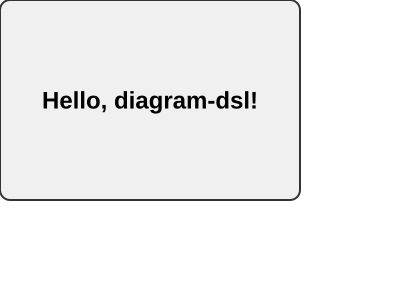</td>
<td>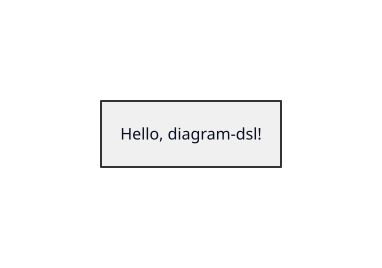</td>
</tr>
</table>

### Basic Flowchart

A simple three-step vertical flowchart showing the basic flow of a process.

<table>
<tr>
<td><b>diagram-dsl output</b></td>
<td><b>D2 output</b></td>
</tr>
<tr>
<td>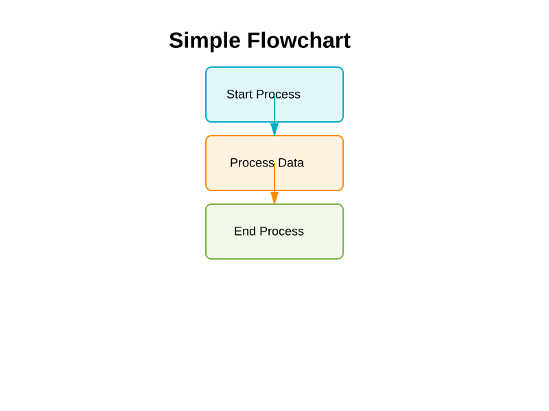</td>
<td>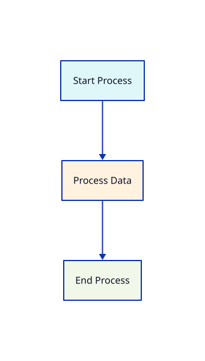</td>
</tr>
</table>

### Architecture Diagram

A three-tier architecture showing Frontend → API → Database flow.

<table>
<tr>
<td><b>diagram-dsl output</b></td>
<td><b>D2 output</b></td>
</tr>
<tr>
<td>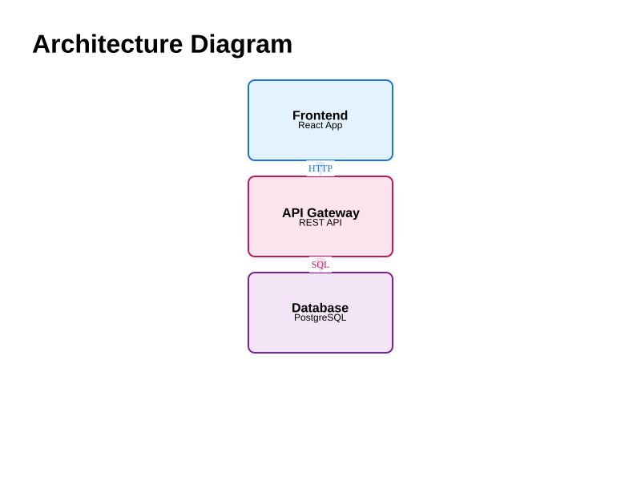</td>
<td>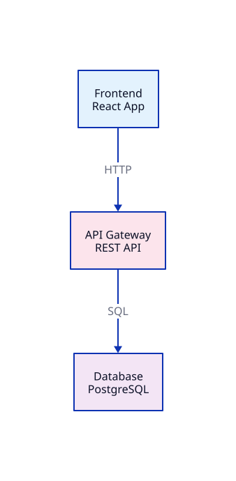</td>
</tr>
</table>

### Styled Flowchart

Modern flowchart using semantic components with professional styling.

<table>
<tr>
<td><b>diagram-dsl output</b></td>
<td><b>D2 output</b></td>
</tr>
<tr>
<td>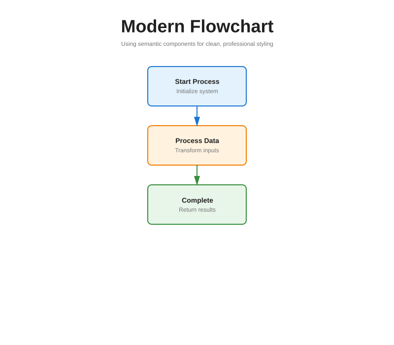</td>
<td>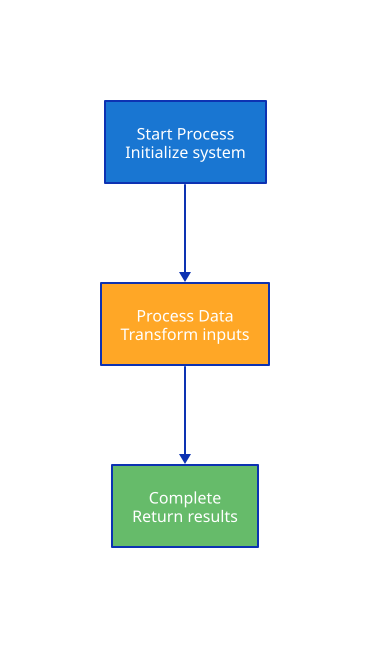</td>
</tr>
</table>

### Styled Architecture

Three-tier architecture with semantic components showing Presentation → Business Logic → Data tiers.

<table>
<tr>
<td><b>diagram-dsl output</b></td>
<td><b>D2 output</b></td>
</tr>
<tr>
<td>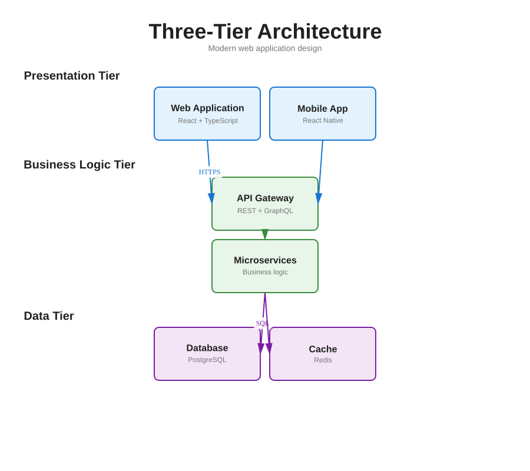</td>
<td>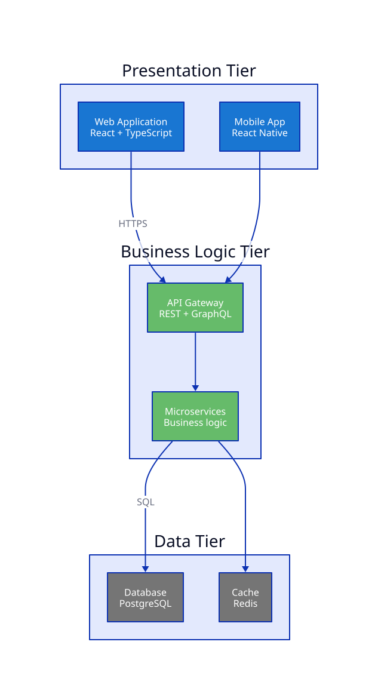</td>
</tr>
</table>

### Multi-Tier Architecture

Comprehensive multi-tier web application architecture with client, application, and data tiers.

<table>
<tr>
<td><b>diagram-dsl output</b></td>
<td><b>D2 output</b></td>
</tr>
<tr>
<td>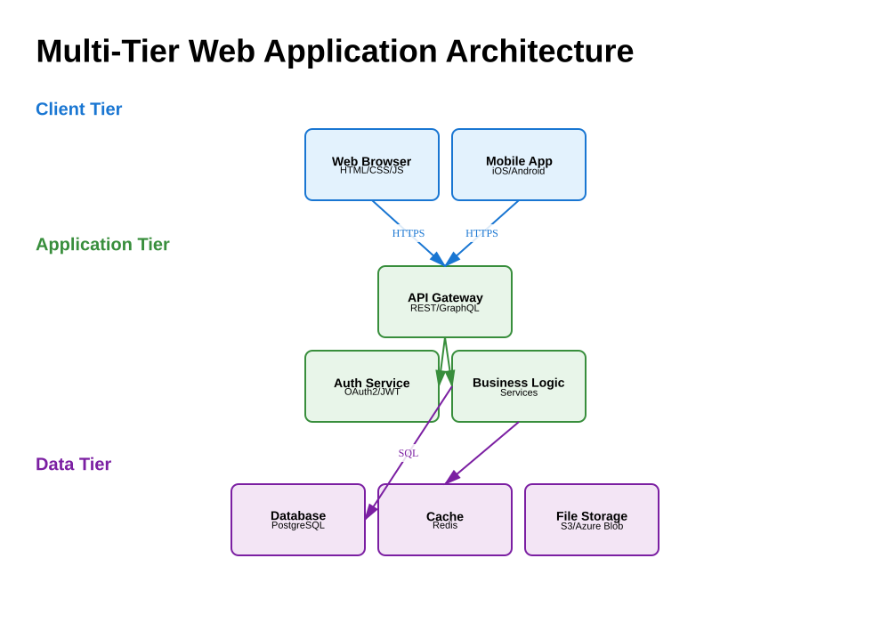</td>
<td>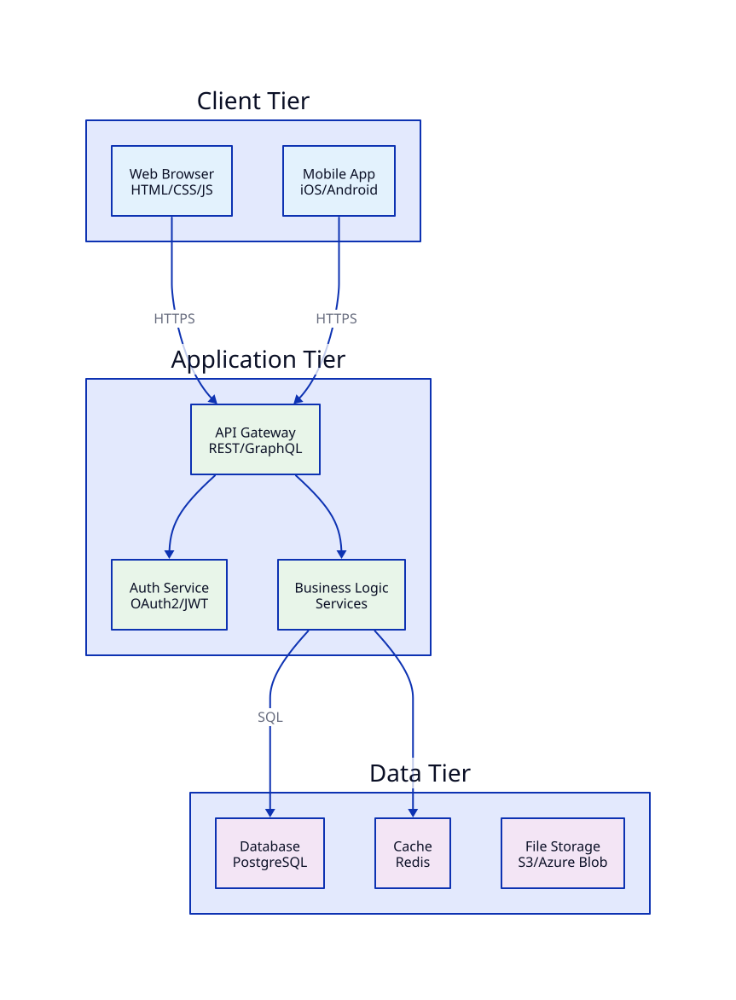</td>
</tr>
</table>

### Decision Flowchart

User authentication flow with conditional branches showing success and failure paths.

<table>
<tr>
<td><b>diagram-dsl output</b></td>
<td><b>D2 output</b></td>
</tr>
<tr>
<td>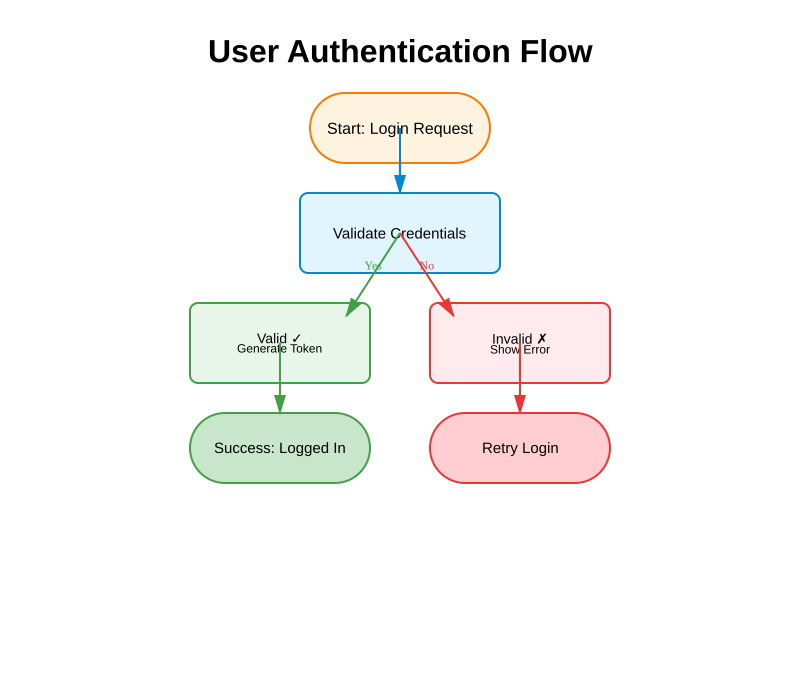</td>
<td>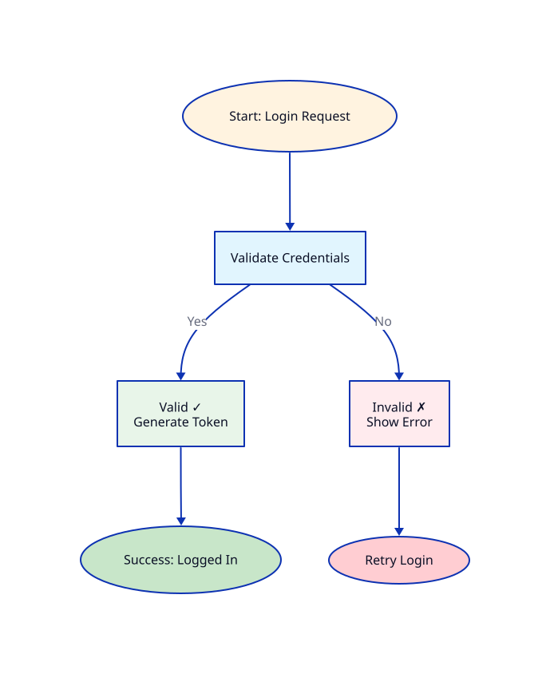</td>
</tr>
</table>

**Key differences:**
- **diagram-dsl** uses React/JSX with explicit layout control (flexbox via Yoga)
- **D2** uses a custom DSL with automatic layout (Dagre/ELK)
- **diagram-dsl** gives precise control over positioning, spacing, and dimensions
- **D2** is more concise but less predictable for complex layouts
- Both produce high-quality SVG output suitable for documentation

D2 files are available in `examples/d2/` directory.

## API

### renderToSVG(element, options)

Renders a React element to SVG string.

```typescript
async function renderToSVG(
  element: ReactElement,
  options?: {
    width?: number;      // Default: 800
    height?: number;     // Default: 600
    backgroundColor?: string;  // Default: 'white'
  }
): Promise<string>
```

### renderToSVGWithLayout(element, options)

Renders to SVG and returns computed layout data for testing.

```typescript
async function renderToSVGWithLayout(
  element: ReactElement,
  options?: RenderOptions
): Promise<{
  svg: string;
  layout: LayoutNode;  // Computed layout tree with positions
}>
```

### Layout Testing

```typescript
import { LayoutAssertions } from 'diagram-dsl';

const { layout } = await renderToSVGWithLayout(<MyDiagram />);
const assertions = new LayoutAssertions(layout);

// Verify layout properties
assertions.assertCentered('text', 'box');
assertions.assertFitsInside('text', 'box', 20);
assertions.assertGap('box1', 'box2', 10);
assertions.assertNoOverlap('box1', 'box2');
```

Run tests: `npm test` - 14 tests total (7 SVG + 7 layout)

### Layout Linting

The library includes a layout linting system that provides warnings about potential visual hierarchy and spacing issues. These are suggestions to help create more professional-looking diagrams.

```typescript
import { LayoutLinter } from 'diagram-dsl';

const { layout } = await renderToSVGWithLayout(<MyDiagram />);
const linter = new LayoutLinter(layout);
const lints = linter.runAllLints();

if (lints.length > 0) {
  console.log(LayoutLinter.formatLints(lints));
}
```

**What it checks:**
- **Short arrows** - Warns when arrows are too short (<20px) and may be hard to see
- **Internal vs external spacing** - Warns when a box's internal padding is larger than the gap to adjacent boxes, which breaks visual hierarchy

Run linter: `npm run lint`  
See [LINTING_GUIDE.md](LINTING_GUIDE.md) for detailed documentation

## Text Measurement

Uses the `canvas` package for accurate text measurement instead of estimates. This ensures text is properly sized and positioned within containers.

```typescript
import { measureText } from 'diagram-dsl';

const metrics = measureText('Hello', 24, 'Arial', 'bold');
// Returns: { width: 102, height: 17 }
```

## Why Yoga?

[Yoga](https://yogalayout.dev/) is Meta's cross-platform layout engine implementing CSS Flexbox. It's battle-tested, used by React Native, and provides predictable layouts without manual calculations.

## Use Cases

- Technical documentation with diagrams
- RFC proposals with architecture diagrams
- Process flowcharts
- System architecture diagrams
- Data flow diagrams
- Slide presentations focused on diagrams

## License

MIT
